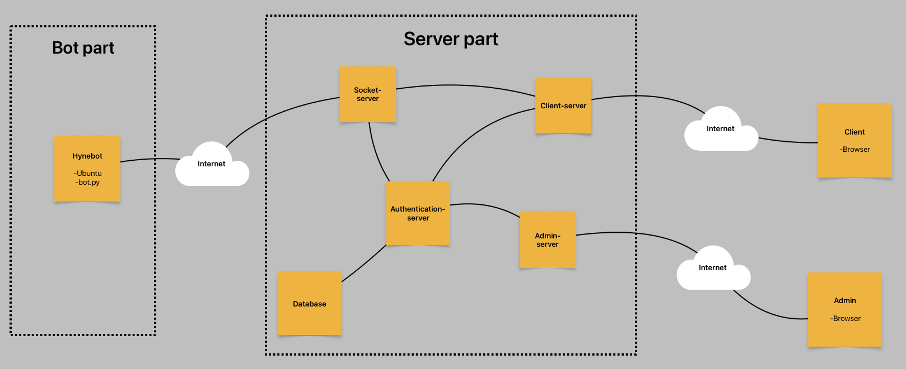

# Hynebot Control Center

The idea behind this project is to allow and handle use of Hynebots over the Internet. This repository contains all programs related to the server part.

Bot part: https://github.com/m1r0-h/hynebot-control-center-bot

## Description

Hynebot is telepresence robot build in the LUT's Hyneman center. It mainly consist ubuntu linux computer, motors and sensors. This Hynebot Control Center is developet to allow this hynebot to be used over the internet task like teaching and visiting.

This Hynebot Control Center consist of tree main components:

- _A python program_ that runs on the bot's computer and controls the robot based on received control messages
- _Node js servers_ run in the cloud. These work between the bot and the client and enable mutual communication.
- _Clients and Admins_. Clients can control the bot with a web browser using a login code. An admin can create these login codes to allow access to control the bot.



The bot's programs are in another repository (hynebot-control-center-bot).

## Table of Contents

- [How to install server part?](#how-to-install-server-part)
- [How to run the servers?](#how-to-run-the-servers)
- [How to make an admin acount?](#how-to-make-an-admin-account)
- [File structure](#file-structure)

## How to install server part

### Node.js and MongoDB

First, you need to install node and mongodb, if you dont have it yet:

- Node.js: https://nodejs.org/en/download
- MongoDB: https://www.mongodb.com/docs/manual/administration/install-community/

Check that both of them work.

### Clone the project.

You can clone the repository with this command.

```bash
git clone git@github.com:m1r0-h/hynebot-control-center.git
```

```bash
cd hynebot-control-center/
```

### Install node modules

The server part of the project consists of four different servers. They are in different folders.

- **admin-server** admin user interface
- **client-server** client user interface
- **authenticatio-server** handles JWT authentication
- **socket-server** handles socket io connections between client and bot

You can install all necessary node modules for all the servers with command:

```bash
npm run preinstall
```

or you can only install one server at the time:

```bash
npm run preinstall:admin
npm run preinstall:auth
npm run preinstall:client
npm run preinstall:socket
```

You can add "dev:" front of the "preinstall" to also install devDependencies:

```bash
npm run dev:preinstall
```

If there are vulnerabilities in the packages you may need to go the server's folder and run "npm audit fix". Example:

```bash
cd admin-server/
```

```bash
npm audit fix
```

### SSL/TLS certificate:

The server uses HTTPS and HTTPS needs SSL/TLS certificate to work. You can use your real ones or make self-signed certificates with this command.

```bash
openssl req -nodes -new -x509 -keyout key.key -out certificate.cert
```

### .env files

Make .env files in each server folder. You can see examples of .env files in each server's own README.md file. Remember to set addresses and tokens...

```bash
nano admin-server/.env
```

```bash
nano authentication-server/.env
```

```bash
nano client-server/.env
```

```bash
nano socket-server/.env
```

### Open nessesary ports

If you want others to be able to use the system, remember to open the necessary ports (TCP).

## How to run the servers

You can run servers with these commands

```bash
npm run auth
```

```bash
npm run client
```

```bash
npm run socket
```

```bash
npm run admin
```

or you can run servers with nodemon by adding dev: (for development). "devDependencies" must be installed.

```bash
npm run dev:client
```

### Auto start (Linux systemd)

You can also make the servers to start automatically with systemd.

For example, make a new services:

```bash
sudo nano /etc/systemd/system/node-admin-server.service
```

```bash
sudo nano /etc/systemd/system/node-authentication-server.service
```

```bash
sudo nano /etc/systemd/system/node-client-server.service
```

```bash
sudo nano /etc/systemd/system/node-socket-server.service
```

Examples:

Admin (node-admin-server):

```
[Unit]
Description=Automaticly start admin-server example
After=network.target mongod.service

[Service]
ExecStart=/home/ubuntu/.nvm/versions/node/v23.6.0/bin/node /home/ubuntu/hynebot-control-center/admin-server/server.js
Restart=no
User=ubuntu
Group=ubuntu
Environment=NODE_ENV=production
WorkingDirectory=/home/ubuntu/hynebot-control-center/admin-server

[Install]
WantedBy=multi-user.target
```

Authentication (node-authentication-server):

```
[Unit]
Description=Automaticly start authentication-server example
After=network.target mongod.service

[Service]
ExecStart=/home/ubuntu/.nvm/versions/node/v23.6.0/bin/node /home/ubuntu/hynebot-control-center/authentication-server/server.js
Restart=no
User=ubuntu
Group=ubuntu
Environment=NODE_ENV=production
WorkingDirectory=/home/ubuntu/hynebot-control-center/authentication-server

[Install]
WantedBy=multi-user.target
```

Client (node-client-server):

```
[Unit]
Description=Automaticly start client-server example
After=network.target mongod.service

[Service]
ExecStart=/home/ubuntu/.nvm/versions/node/v23.6.0/bin/node /home/ubuntu/hynebot-control-center/client-server/server.js
Restart=no
User=ubuntu
Group=ubuntu
Environment=NODE_ENV=production
WorkingDirectory=/home/ubuntu/hynebot-control-center/client-server

[Install]
WantedBy=multi-user.target
```

Socket (node-socket-server):

```
[Unit]
Description=Automaticly start socket-server example
After=network.target mongod.service

[Service]
ExecStart=/home/ubuntu/.nvm/versions/node/v23.6.0/bin/node /home/ubuntu/hynebot-control-center/socket-server/server.js
Restart=no
User=ubuntu
Group=ubuntu
Environment=NODE_ENV=production
WorkingDirectory=/home/ubuntu/hynebot-control-center/socket-server

[Install]
WantedBy=multi-user.target
```

You can do this for all the server parts.

Once the services have been added, remember enable them.

```bash
sudo systemctl enable node-admin-server.service
```

```bash
sudo systemctl enable node-authentication-server.service
```

```bash
sudo systemctl enable node-client-server.service
```

```bash
sudo systemctl enable node-socket-server.service
```

```bash
sudo systemctl daemon-reload
```

```bash
sudo reboot
```

## How to make an admin account

So far, the only way to make an admin account is to add it directly to the mongodb database. Collection "Admin" must be created under the "Hynebot" database and login information must be put there. The account password must be encrypted to SHA512 and converted to hexadecimal format. makeAdminPassword.py program can be used to do this password conversion.

How to add login credentials to the database:

```bash
mongosh
```

```bash
use Hynebot
```

```bash
show collections
```

Example. Change the admin name and password to your own.

```bash
db.Admin.insertOne({
    "username": "admin",
    "password": "d813490d953e3fa8eacd84b29ce7c36feeb73e0f28226d46c5b94ed424621c6bb609297693ae89ef97e38430c4ea851c8abd4cc81564e7e5066ea52288f8e608"
})
```

## File structure

```bash
hynebot-control-center/
│
├── admin-server/             # Admin frontend server directory
│   └── ...
│
├── authentication-server/    # Authentication server directory
│   └── ...
│
├── client-server/            # Client frontend server directory
│   └── ...
│
├── socket-server/            # socket server directory
│   └── ...
│
│
├── .gitignore
│
├── makeAdminPassword.py
│
├── package.json
│
├── README.md                 # Documentation file (this file)
│
└── system_structure.png      # System structure picture
```
