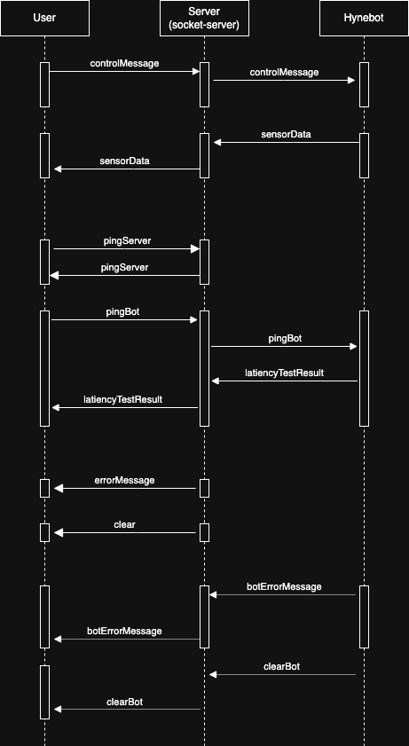

# Socket server

This Node.js server handles socket connections (socket.io) and allow communication betweed clients and bots. This server uses json web tokens to authenticate users. The creation of these tokens takes place on the authentication server.

## Setup

Make an .env file and add necessary variables to it ([Example .env file](#example-env-file)):

```bash
nano .env
```

Install production dependencies:

```bash
npm install --production
```

or install all dependencies (for development):

```bash
npm install
```

## Run server

Start server:

```bash
npm start
```

Start server with nodemon (for development):

```bash
npm run dev
```

## Example .env file

```
SSL_CERT_PATH=../certificate.cert
SSL_KEY_PATH=../key.key
CLIENT_TOKEN_SECRET=secret_client
BOT_TOKEN_SECRET=secret_bot
PORT=8083
ALLOWED_ORIGINS=*
VERIFICATION_TOKEN=verification_token_for_the_bot
```

## File structure

```bash
client-server/
│
├── .env                # Environment variables
│
├── package-lock.json
│
├── package.json
│
├── server.js           # Main server file
│
└── README.md           # Documentation file (this file)
```

## Socket.io events

This hynebot control system uses several different (Socket.io) events to transmit different information. All events and what they are used for are listed below:

Main messages:

- "controlMessage" - The event is used to send control messages to the bot.
- "sensorData" - The event is used to send sensor data from the bot to the client.

Latiency measurement:

- "pingServer" - With this event, a client can send a message to the server from which the client receives a response back. This response allows the client to calculate delay between the client and the server.
- "pingBot" - This event together with the "latencyTestResult" event is used to calculate latency between the client and the bot.
- "latencyTestResult" - The acknowledgment to the "pingBot" event is sent via this event.

Error messages:

- "errorMessage" - This event is used to display server error messages to the client.
- "botErrorMessage" - This event is used to display bot error messages to the client.
- "clear" - This event clears the "errorMessage" from the control page.
- "clearBot" - This event clears the "botErrorMessage" from the control page.


